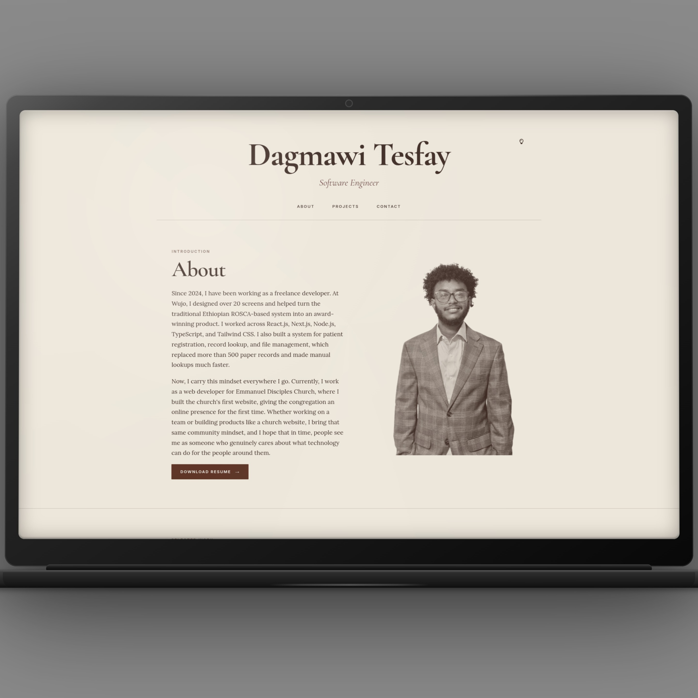

# Dagmawi Tesfay Portfolio

A personal portfolio website for Dagmawi Tesfay, a software engineer and product designer focused on building polished, user-centered digital experiences.

## Overview

This project showcases:

- About and introduction section
- Selected projects with live links and GitHub references
- Responsive layout for desktop and mobile screens
- Clean, modern visual design with custom typography and branding
- Contact information and social links

## portfolio-mockup

## Tech Stack

- HTML5
- CSS3
- JavaScript
- Google Fonts
- Responsive web design

## Live Demo

dagmawitesfay.netlify.app/

## Contact

- GitHub: https://github.com/Dagi2004
- LinkedIn: https://www.linkedin.com/in/dagmawi-tesfay/

## About the Work

The portfolio highlights a range of freelance and product design work, including church websites, fintech concept design, and bakery landing pages. The design emphasizes clarity, usability, and a strong narrative around the client's needs and outcomes.
